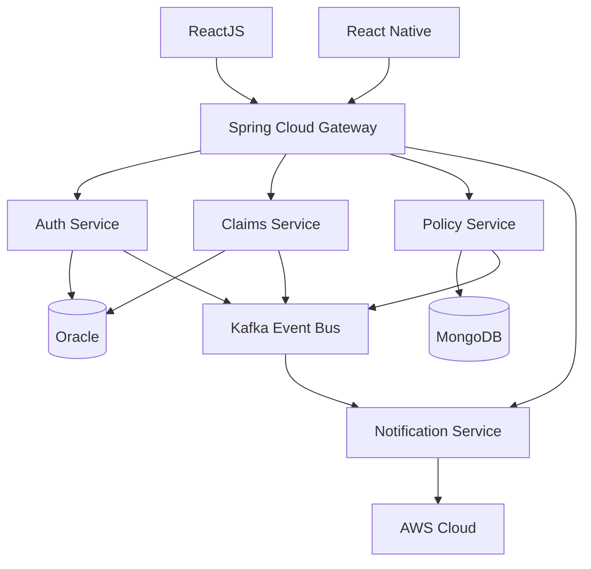

<div align="center">


<br><br>

# 👋 Welcome to My GitHub

### Building Enterprise-Scale Applications with Java, Spring Boot, React, AWS & AI

<br>

[](https://git.io/typing-svg)

<br>

<a href="https://www.linkedin.com/in/chaitanya-fullstacks/">

</a>

<a href="mailto:chaitanya.fullstackdev@gmail.com">

</a>


</div>

---

# 👋 About Me

```yaml
Name: Chaitanya

Role: Senior Full Stack Developer

Experience: 8+ Years

Current Focus:
  - AI-Augmented Applications
  - Enterprise Architecture
  - Microservices
  - Cloud Native Systems
  - React Native Mobile Apps

Domains:
  - Retail
  - Banking
  - Insurance
  - Healthcare

Location:
  Philadelphia, Pennsylvania

Work Authorization:
  US Green Card Holder
```

---

# 🚀 Tech Stack

<div align="center">

### Backend


### Frontend


### Mobile


### Cloud & DevOps


### Database


### Tools


</div>

---

# 🤖 AI & LLM Engineering

<table>
<tr>
<td width="50%">

## AI Customer Support Solutions

* LLM API Integrations
* Conversational AI
* Prompt Engineering
* RAG Architectures
* Semantic Search
* Context-Aware Chatbots
* Workflow Automation

</td>

<td width="50%">

## Enterprise AI

* Claims Automation
* Policy Validation
* Customer Service Bots
* Knowledge Assistants
* Intelligent Routing
* AI-Augmented Development
* Process Optimization

</td>
</tr>
</table>

---

# 🏗 Enterprise Architecture



---

# 💼 Professional Experience

## Walmart | Senior Full Stack Developer

**Aug 2023 – Present**

* Built AI-powered customer support chatbots using LLM APIs
* Developed ReactJS and React Native enterprise applications
* Implemented OAuth2, JWT, RBAC security
* Designed micro frontends using Module Federation
* Built Spring Boot microservices
* Integrated Kafka-based event processing
* Automated AWS CI/CD pipelines using Jenkins and Docker

---

## Meta | Java Full Stack Developer

**May 2021 – Jul 2023**

* Developed enterprise React Native applications
* Designed Spring Boot REST APIs
* Migrated monolithic systems to microservices
* Built AWS Lambda serverless services
* Implemented MongoDB and Oracle data solutions
* Achieved 85%+ code coverage using JUnit and Mockito

---

## Comcast | Java Developer

**Jun 2017 – Apr 2021**

* Built Spring Boot microservices
* Developed Angular and React applications
* Deployed applications on AWS ECS and EC2
* Managed Kubernetes orchestration
* Implemented Hazelcast caching
* Developed event-driven systems using Kafka

---

# 🚀 Featured Projects

<div align="center">

<a href="https://github.com/Chaitanya-Suryadevara/NumberlinkGame-main">
  
</a>

<a href="https://github.com/Chaitanya-Suryadevara/Acronym">
  
</a>

<a href="https://github.com/Chaitanya-Suryadevara/Weatherapp">
  
</a>

</div>

---

# 📌 Project Highlights

<table>
<tr>
<td width="50%">

### 🎮 Numberlink Game

- Java-based puzzle game
- Algorithmic problem solving
- Interactive gameplay
- Object-Oriented Design
- Clean architecture

</td>

<td width="50%">

### 🔤 Acronym Generator

- REST API integration
- Data parsing
- Java backend implementation
- JSON processing
- API-driven development

</td>
</tr>

<tr>
<td width="50%">

### 📦 Inventory Management System

- Spring Boot application
- CRUD operations
- Database integration
- Business workflow automation
- Enterprise application patterns

</td>

<td width="50%">

### 🌦️ Weather App

- External API integration
- Real-time weather data
- Responsive UI
- JavaScript / Frontend development
- User-friendly dashboard

</td>
</tr>
</table>

---

# 📊 Technical Expertise

```text
Java                  ████████████████████ 95%

Spring Boot           ███████████████████ 92%

Microservices         ███████████████████ 92%

React                 ██████████████████ 88%

AWS                   █████████████████ 85%

Kafka                 █████████████████ 85%

AI Integration        █████████████████ 85%

React Native          ████████████████ 80%
```

---

# 📈 GitHub Statistics

<div align="center">


</div>

---

# 🔥 GitHub Streak

<div align="center">


</div>

---

# 📊 GitHub Metrics

<div align="center">


</div>

---

# 🏆 Career Highlights

* 8+ Years of Enterprise Software Development
* AI & LLM Integration Specialist
* Cloud-Native Application Development
* Enterprise Security & Authentication
* Event-Driven Architecture Design
* React Native Mobile Development
* Banking, Insurance, Retail & Healthcare Experience

---

# 🎓 Education

### Master of Science

Computer Science & Information Systems

Stratford University

---

# 🌐 Connect With Me

<p align="center">

<a href="mailto:chaitanya.fullstackdev@gmail.com">

</a>

<a href="https://www.linkedin.com/in/chaitanya-fullstacks/">

</a>

</p>

---

<div align="center">

### 🚀 Building Enterprise-Scale AI Solutions

⭐ If you like my work, consider following my journey and exploring my repositories.

</div>


